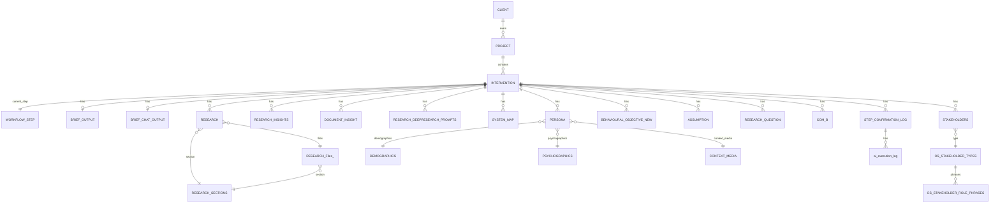

# Xano Stage 1: Understand - Database Reference

**Generated:** 2026-02-13

This document provides comprehensive reference for all Xano database tables and API endpoints
used in Stage 1: Understand of the Kora intervention design workflow.

## Summary

- **Total Tables Documented:** 27
- **Total API Groups:** 15
- **Total API Endpoints:** 183

**Tables by Category:**
- Core Entities: 4 tables
- Stage 1: Brief: 2 tables
- Stage 1: Research: 6 tables
- Stage 1: System Map: 4 tables
- Stage 1: Behavioural Objective: 1 tables
- Stage 1: Assumption Testing: 2 tables
- Stage 1: COM-B & Personas: 5 tables
- Step Tracking: 3 tables

## Quick Reference: Tables by Functional Area

| Table Name | ID | Category | Purpose |
|------------|----|-----------|---------| 
| USER | 279 | Core Entities | User authentication and profile |
| CLIENT | 291 | Core Entities | Client organizations |
| PROJECT | 292 | Core Entities | Projects within clients |
| INTERVENTION | 293 | Core Entities | Individual interventions (central entity) |
| BRIEF_OUTPUT | 294 | Stage 1: Brief | Brief form data (structured) |
| BRIEF_CHAT_OUTPUT | 303 | Stage 1: Brief | Brief chat output (AI-generated) |
| RESEARCH | 297 | Stage 1: Research | Research content by section |
| RESEARCH_Files_ | 304 | Stage 1: Research | Research files and URLs |
| RESEARCH_SECTIONS | 298 | Stage 1: Research | Research section definitions |
| RESEARCH_DEEPRESEARCH_PROMPTS | 309 | Stage 1: Research | Deep research prompts |
| RESEARCH_INSIGHTS | 337 | Stage 1: Research | Research insights extracted |
| DOCUMENT_INSIGHT | 344 | Stage 1: Research | Document-level insights |
| SYSTEM_MAP | 338 | Stage 1: System Map | System map visualization data |
| STAKEHOLDERS | 299 | Stage 1: System Map | Stakeholders in system map |
| OS_STAKEHOLDER_TYPES | 300 | Stage 1: System Map | Stakeholder type definitions |
| OS_STAKEHOLDER_ROLE_PHRASES | 301 | Stage 1: System Map | Role phrase templates for stakeholders |
| BEHAVIOURAL_OBJECTIVE_NEW | 340 | Stage 1: Behavioural Objective | Behavioural objectives (with selection) |
| ASSUMPTION | 341 | Stage 1: Assumption Testing | Assumptions to test |
| RESEARCH_QUESTION | 342 | Stage 1: Assumption Testing | Research questions for testing |
| COM_B | 347 | Stage 1: COM-B & Personas | COM-B barriers analysis |
| PERSONA | 348 | Stage 1: COM-B & Personas | User personas |
| DEMOGRAPHICS | 306 | Stage 1: COM-B & Personas | Demographic data for personas |
| PSYCHOGRAPHICS | 307 | Stage 1: COM-B & Personas | Psychographic data for personas |
| CONTEXT_MEDIA | 308 | Stage 1: COM-B & Personas | Context and media for personas |
| STEP_CONFIRMATION_LOG | 305 | Step Tracking | Step completion tracking |
| WORKFLOW_STEP | 302 | Step Tracking | Workflow step definitions |
| ai_execution_log | 312 | Step Tracking | AI execution audit log |

## Entity Relationship Diagram



## Table of Contents

1. [Core Entities](#core-entities)
2. [Stage 1: Brief](#stage-1-brief)
3. [Stage 1: Research](#stage-1-research)
4. [Stage 1: System Map](#stage-1-system-map)
5. [Stage 1: Behavioural Objective](#stage-1-behavioural-objective)
6. [Stage 1: Assumption Testing](#stage-1-assumption-testing)
7. [Stage 1: COM-B & Personas](#stage-1-com-b--personas)
8. [Step Tracking](#step-tracking)
9. [API Endpoints](#api-endpoints)
10. [Entity Relationships](#entity-relationships)
11. [Front-End Mapping](#front-end-mapping)
12. [Questions & Flags](#questions--flags)

---

## Core Entities

### USER (ID: 279)

**Tags:** active

**Columns:**

#### `id`
- **Type:** int
- **Nullable:** False
- **Required:** True
- **Access:** public
- **Style:** single

#### `created_at`
- **Type:** timestamp
- **Nullable:** False
- **Required:** False
- **Access:** private
- **Style:** single
- **Default:** `now`

#### `name`
- **Type:** text
- **Nullable:** False
- **Required:** False
- **Access:** public
- **Style:** single
- **Validators:** trim=True

#### `email`
- **Type:** email
- **Nullable:** True
- **Required:** False
- **Access:** public
- **Style:** single
- **Validators:** trim=True, lower=True

#### `password`
- **Type:** password
- **Nullable:** True
- **Required:** False
- **Access:** internal
- **Style:** single
- **Validators:** min=8, minAlpha=1, minDigit=1

#### `role_id`
- **Type:** int
- **Nullable:** False
- **Required:** True
- **Access:** private
- **Style:** single
- **Default:** `0`
- **References Table ID:** 284
- **Description:** This column contains the role of the user.

#### `magic_link`
- **Type:** object
- **Nullable:** True
- **Required:** False
- **Access:** public
- **Style:** single
- **Description:** Magic link object with token and expiration

#### `is_deleted`
- **Type:** bool
- **Nullable:** False
- **Required:** False
- **Access:** private
- **Style:** single
- **Description:** This column is used to indicate whether an user is active or inactive.

#### `last_login`
- **Type:** timestamp
- **Nullable:** True
- **Required:** False
- **Access:** private
- **Style:** single
- **Description:** This column keeps track of the login times of the user.

#### `last_url`
- **Type:** text
- **Nullable:** False
- **Required:** False
- **Access:** public
- **Style:** single
- **Validators:** trim=True

---

### CLIENT (ID: 291)

**Description:** This table will allow us to store a list of clients

**Tags:** client, active

**Columns:**

#### `id`
- **Type:** int
- **Nullable:** False
- **Required:** True
- **Access:** public
- **Style:** single

#### `created_at`
- **Type:** timestamp
- **Nullable:** False
- **Required:** False
- **Access:** private
- **Style:** single
- **Default:** `now`

#### `name`
- **Type:** text
- **Nullable:** False
- **Required:** False
- **Access:** public
- **Style:** single
- **Validators:** trim=True, min=2, max=80

#### `description`
- **Type:** text
- **Nullable:** False
- **Required:** False
- **Access:** public
- **Style:** single
- **Validators:** trim=True

#### `is_deleted`
- **Type:** bool
- **Nullable:** False
- **Required:** False
- **Access:** private
- **Style:** single

---

### PROJECT (ID: 292)

**Description:** This table will allow us to store a clients projects

**Tags:** project, active

**Columns:**

#### `id`
- **Type:** int
- **Nullable:** False
- **Required:** True
- **Access:** public
- **Style:** single

#### `created_at`
- **Type:** timestamp
- **Nullable:** False
- **Required:** False
- **Access:** private
- **Style:** single
- **Default:** `now`

#### `name`
- **Type:** text
- **Nullable:** False
- **Required:** False
- **Access:** public
- **Style:** single
- **Validators:** trim=True

#### `description`
- **Type:** text
- **Nullable:** False
- **Required:** False
- **Access:** internal
- **Style:** single
- **Validators:** trim=True

#### `client_id`
- **Type:** int
- **Nullable:** False
- **Required:** True
- **Access:** public
- **Style:** single
- **Default:** `0`
- **References Table ID:** 291
- **Description:** This is a reference to CLIENT table

#### `number_of_interventions`
- **Type:** int
- **Nullable:** True
- **Required:** False
- **Access:** public
- **Style:** single
- **Default:** `0`

#### `last_updated_at`
- **Type:** timestamp
- **Nullable:** True
- **Required:** False
- **Access:** public
- **Style:** single

#### `is_deleted`
- **Type:** bool
- **Nullable:** False
- **Required:** False
- **Access:** public
- **Style:** single

---

### INTERVENTION (ID: 293)

**Description:** This table stores all project interventions

**Tags:** intervention, active

**Columns:**

#### `id`
- **Type:** int
- **Nullable:** False
- **Required:** True
- **Access:** public
- **Style:** single

#### `created_at`
- **Type:** timestamp
- **Nullable:** False
- **Required:** False
- **Access:** private
- **Style:** single
- **Default:** `now`

#### `name`
- **Type:** text
- **Nullable:** False
- **Required:** False
- **Access:** public
- **Style:** single
- **Validators:** trim=True

#### `current_step`
- **Type:** int
- **Nullable:** False
- **Required:** False
- **Access:** public
- **Style:** single
- **Default:** `0`
- **References Table ID:** 302

#### `description`
- **Type:** text
- **Nullable:** False
- **Required:** False
- **Access:** internal
- **Style:** single
- **Validators:** trim=True

#### `project_id`
- **Type:** int
- **Nullable:** False
- **Required:** True
- **Access:** public
- **Style:** single
- **Default:** `0`
- **References Table ID:** 292
- **Description:** This is a reference to PROJECT table

#### `is_deleted`
- **Type:** bool
- **Nullable:** False
- **Required:** False
- **Access:** public
- **Style:** single

#### `is_duplicated`
- **Type:** bool
- **Nullable:** False
- **Required:** False
- **Access:** private
- **Style:** single

#### `last_modified`
- **Type:** timestamp
- **Nullable:** True
- **Required:** False
- **Access:** public
- **Style:** single

#### `chat_id`
- **Type:** text
- **Nullable:** False
- **Required:** False
- **Access:** public
- **Style:** single
- **Validators:** trim=True
- **Description:** unique id of the chat

#### `helper_text`
- **Type:** int
- **Nullable:** False
- **Required:** False
- **Access:** public
- **Style:** single
- **Default:** `0`
- **References Table ID:** 339

#### `percentage`
- **Type:** int
- **Nullable:** False
- **Required:** False
- **Access:** public
- **Style:** single
- **Default:** `0`

---


## Stage 1: Brief

### BRIEF_OUTPUT (ID: 294)

**Tags:** active, brief, v2

**Columns:**

#### `id`
- **Type:** int
- **Nullable:** False
- **Required:** True
- **Access:** public
- **Style:** single

#### `created_at`
- **Type:** timestamp
- **Nullable:** False
- **Required:** False
- **Access:** private
- **Style:** single
- **Default:** `now`

#### `intervention_id`
- **Type:** int
- **Nullable:** False
- **Required:** False
- **Access:** public
- **Style:** single
- **Default:** `0`
- **References Table ID:** 293

#### `client`
- **Type:** text
- **Nullable:** False
- **Required:** False
- **Access:** public
- **Style:** single
- **Validators:** trim=True

#### `location`
- **Type:** text
- **Nullable:** False
- **Required:** False
- **Access:** public
- **Style:** single
- **Validators:** trim=True, min=1

#### `budget_currency`
- **Type:** enum
- **Nullable:** False
- **Required:** False
- **Access:** public
- **Style:** single
- **Enum Values:** `￡`, `€`, `$`, `£`

#### `budget_min`
- **Type:** int
- **Nullable:** False
- **Required:** False
- **Access:** public
- **Style:** single

#### `budget_max`
- **Type:** int
- **Nullable:** False
- **Required:** False
- **Access:** public
- **Style:** single

#### `timeline_unit`
- **Type:** enum
- **Nullable:** False
- **Required:** False
- **Access:** public
- **Style:** single
- **Enum Values:** `Days`, `Weeks`, `Months`, `Years`

#### `timeline_min`
- **Type:** int
- **Nullable:** False
- **Required:** False
- **Access:** public
- **Style:** single

#### `timeline_max`
- **Type:** int
- **Nullable:** False
- **Required:** False
- **Access:** public
- **Style:** single

#### `problem_definition`
- **Type:** text
- **Nullable:** False
- **Required:** False
- **Access:** public
- **Style:** single
- **Validators:** trim=True

#### `high_level_objective`
- **Type:** text
- **Nullable:** False
- **Required:** False
- **Access:** public
- **Style:** single
- **Validators:** trim=True

#### `is_confirmed`
- **Type:** bool
- **Nullable:** False
- **Required:** False
- **Access:** public
- **Style:** single

#### `section_stage_id`
- **Type:** int
- **Nullable:** False
- **Required:** False
- **Access:** public
- **Style:** single

#### `expected_deliverables`
- **Type:** text
- **Nullable:** False
- **Required:** False
- **Access:** public
- **Style:** single
- **Validators:** trim=True

#### `ta_profile`
- **Type:** text
- **Nullable:** False
- **Required:** False
- **Access:** private
- **Style:** list
- **Format:** plaintext
- **Validators:** trim=True
- **Description:** This column will store a list of texts for ta_profile.

#### `dos`
- **Type:** text
- **Nullable:** False
- **Required:** False
- **Access:** private
- **Style:** list
- **Validators:** trim=True
- **Description:** This column will store a list of texts for do's.

#### `donts`
- **Type:** text
- **Nullable:** False
- **Required:** False
- **Access:** private
- **Style:** list
- **Validators:** trim=True
- **Description:** This column will store a list of texts for don'ts.

---

### BRIEF_CHAT_OUTPUT (ID: 303)

**Description:** Stores detailed content for a brief, linked exclusively to an intervention.

**Tags:** active, brief, v2

**Columns:**

#### `id`
- **Type:** int
- **Nullable:** False
- **Required:** True
- **Access:** public
- **Style:** single

#### `created_at`
- **Type:** timestamp
- **Nullable:** False
- **Required:** False
- **Access:** private
- **Style:** single
- **Default:** `now`

#### `intervention_id`
- **Type:** int
- **Nullable:** False
- **Required:** False
- **Access:** public
- **Style:** single
- **References Table ID:** 293
- **Description:** Links to the associated intervention.

#### `client_funder`
- **Type:** text
- **Nullable:** False
- **Required:** False
- **Access:** public
- **Style:** single
- **Validators:** trim=True
- **Description:** The client or funding organization for the brief.

#### `core_challenge`
- **Type:** text
- **Nullable:** False
- **Required:** False
- **Access:** public
- **Style:** single
- **Validators:** trim=True
- **Description:** The primary challenge addressed by the brief.

#### `initial_objective`
- **Type:** text
- **Nullable:** False
- **Required:** False
- **Access:** public
- **Style:** single
- **Validators:** trim=True
- **Description:** The initial objective for the brief.

#### `initial_target_audience`
- **Type:** text
- **Nullable:** False
- **Required:** False
- **Access:** public
- **Style:** single
- **Validators:** trim=True
- **Description:** Detailed description of the initial target audience.

#### `location`
- **Type:** text
- **Nullable:** False
- **Required:** False
- **Access:** public
- **Style:** single
- **Validators:** trim=True
- **Description:** Geographical focus for the brief.

#### `dos`
- **Type:** text
- **Nullable:** False
- **Required:** False
- **Access:** public
- **Style:** list
- **Validators:** trim=True
- **Description:** A list of 'do' guidelines for the brief.

#### `donts`
- **Type:** text
- **Nullable:** False
- **Required:** False
- **Access:** public
- **Style:** list
- **Validators:** trim=True
- **Description:** A list of 'don't' guidelines for the brief.

#### `budget_amount`
- **Type:** decimal
- **Nullable:** False
- **Required:** False
- **Access:** public
- **Style:** single
- **Description:** The allocated budget amount for the brief.

#### `budget_currency`
- **Type:** text
- **Nullable:** False
- **Required:** False
- **Access:** public
- **Style:** single
- **Validators:** trim=True
- **Description:** The currency of the allocated budget (e.g., 'USD').

#### `timeline_end_date`
- **Type:** date
- **Nullable:** False
- **Required:** False
- **Access:** public
- **Style:** single
- **Description:** The target completion date for the brief.

#### `expected_outputs`
- **Type:** text
- **Nullable:** False
- **Required:** False
- **Access:** public
- **Style:** single
- **Validators:** trim=True

#### `suggested_intervention_type`
- **Type:** text
- **Nullable:** False
- **Required:** False
- **Access:** public
- **Style:** single
- **Validators:** trim=True
- **Description:** The suggested type of intervention for the brief.

---


## Stage 1: Research

### RESEARCH (ID: 297)

**Description:** This table will store data for Research tab of Understand stage.

**Tags:** research-table, inactive

**Columns:**

#### `id`
- **Type:** int
- **Nullable:** False
- **Required:** True
- **Access:** public
- **Style:** single

#### `created_at`
- **Type:** timestamp
- **Nullable:** False
- **Required:** False
- **Access:** private
- **Style:** single
- **Default:** `now`

#### `intervention_id`
- **Type:** int
- **Nullable:** False
- **Required:** False
- **Access:** public
- **Style:** single
- **Default:** `0`
- **References Table ID:** 293

#### `content`
- **Type:** text
- **Nullable:** False
- **Required:** False
- **Access:** public
- **Style:** single
- **Validators:** trim=True

#### `proprietary_findings`
- **Type:** text
- **Nullable:** True
- **Required:** False
- **Access:** public
- **Style:** single
- **Validators:** trim=True

#### `proprietary_links`
- **Type:** text
- **Nullable:** True
- **Required:** False
- **Access:** public
- **Style:** list
- **Validators:** trim=True

#### `proprietary_uploaded_files`
- **Type:** attachment
- **Nullable:** True
- **Required:** False
- **Access:** public
- **Style:** list

#### `research_sections_id`
- **Type:** int
- **Nullable:** False
- **Required:** False
- **Access:** public
- **Style:** single
- **Default:** `0`
- **References Table ID:** 298

#### `is_skipped`
- **Type:** bool
- **Nullable:** False
- **Required:** False
- **Access:** public
- **Style:** single

#### `research_files_id`
- **Type:** uuid
- **Nullable:** True
- **Required:** False
- **Access:** public
- **Style:** list
- **References Table ID:** 304

---

### RESEARCH_Files_ (ID: 304)

**Tags:** active, deep_research, existing_research, assumption_finding, v2

**Columns:**

#### `id`
- **Type:** uuid
- **Nullable:** False
- **Required:** True
- **Access:** public
- **Style:** single

#### `created_at`
- **Type:** timestamp
- **Nullable:** False
- **Required:** False
- **Access:** private
- **Style:** single
- **Default:** `now`

#### `intervention_id`
- **Type:** int
- **Nullable:** False
- **Required:** True
- **Access:** public
- **Style:** single
- **References Table ID:** 293

#### `status`
- **Type:** enum
- **Nullable:** False
- **Required:** False
- **Access:** public
- **Style:** single
- **Default:** `pending`
- **Enum Values:** `completed`, `pending`, `started`, `failed`

#### `type`
- **Type:** enum
- **Nullable:** False
- **Required:** True
- **Access:** public
- **Style:** single
- **Enum Values:** `findings`, `file`, `url`

#### `subsection`
- **Type:** enum
- **Nullable:** False
- **Required:** True
- **Access:** public
- **Style:** single
- **Enum Values:** `proprietary`, `external`, `deep`, `existing`, `findings`

#### `value`
- **Type:** json
- **Nullable:** False
- **Required:** False
- **Access:** public
- **Style:** single

#### `file`
- **Type:** attachment
- **Nullable:** True
- **Required:** False
- **Access:** public
- **Style:** single

#### `section_id`
- **Type:** int
- **Nullable:** False
- **Required:** False
- **Access:** public
- **Style:** single
- **Default:** `0`
- **References Table ID:** 298

#### `txt_value`
- **Type:** text
- **Nullable:** False
- **Required:** False
- **Access:** public
- **Style:** single
- **Validators:** trim=True

---

### RESEARCH_SECTIONS (ID: 298)

**Tags:** active

**Columns:**

#### `id`
- **Type:** int
- **Nullable:** False
- **Required:** True
- **Access:** public
- **Style:** single

#### `created_at`
- **Type:** timestamp
- **Nullable:** False
- **Required:** False
- **Access:** private
- **Style:** single
- **Default:** `now`

#### `name`
- **Type:** text
- **Nullable:** False
- **Required:** False
- **Access:** public
- **Style:** single
- **Validators:** trim=True

#### `reseach_section_id`
- **Type:** int
- **Nullable:** False
- **Required:** False
- **Access:** public
- **Style:** single

---

### RESEARCH_DEEPRESEARCH_PROMPTS (ID: 309)

**Tags:** active

**Columns:**

#### `id`
- **Type:** int
- **Nullable:** False
- **Required:** True
- **Access:** public
- **Style:** single

#### `created_at`
- **Type:** timestamp
- **Nullable:** False
- **Required:** False
- **Access:** private
- **Style:** single
- **Default:** `now`

#### `intervention_id`
- **Type:** int
- **Nullable:** False
- **Required:** True
- **Access:** public
- **Style:** single
- **Default:** `0`
- **References Table ID:** 293

#### `prompt`
- **Type:** text
- **Nullable:** False
- **Required:** False
- **Access:** public
- **Style:** single
- **Format:** markdown
- **Validators:** trim=True

---

### RESEARCH_INSIGHTS (ID: 337)

**Tags:** active, research_insights, v2

**Columns:**

#### `id`
- **Type:** uuid
- **Nullable:** False
- **Required:** True
- **Access:** public
- **Style:** single

#### `created_at`
- **Type:** timestamp
- **Nullable:** False
- **Required:** False
- **Access:** private
- **Style:** single
- **Default:** `now`

#### `intervention_id`
- **Type:** int
- **Nullable:** False
- **Required:** False
- **Access:** public
- **Style:** single
- **References Table ID:** 293

#### `insight`
- **Type:** text
- **Nullable:** False
- **Required:** False
- **Access:** public
- **Style:** single
- **Validators:** trim=True

#### `description`
- **Type:** text
- **Nullable:** False
- **Required:** False
- **Access:** public
- **Style:** single
- **Validators:** trim=True

#### `source`
- **Type:** enum
- **Nullable:** False
- **Required:** False
- **Access:** public
- **Style:** list
- **Enum Values:** `Existing research`, `DeepResearch`

---

### DOCUMENT_INSIGHT (ID: 344)

**Tags:** active

**Columns:**

#### `id`
- **Type:** uuid
- **Nullable:** False
- **Required:** True
- **Access:** public
- **Style:** single

#### `created_at`
- **Type:** timestamp
- **Nullable:** False
- **Required:** False
- **Access:** private
- **Style:** single
- **Default:** `now`

#### `insight`
- **Type:** text
- **Nullable:** False
- **Required:** False
- **Access:** public
- **Style:** single
- **Validators:** trim=True

#### `source`
- **Type:** text
- **Nullable:** False
- **Required:** False
- **Access:** public
- **Style:** single
- **Validators:** trim=True

#### `page`
- **Type:** text
- **Nullable:** False
- **Required:** False
- **Access:** public
- **Style:** single
- **Validators:** trim=True

#### `sectionTitle`
- **Type:** text
- **Nullable:** False
- **Required:** False
- **Access:** public
- **Style:** single
- **Validators:** trim=True

#### `keywords`
- **Type:** text
- **Nullable:** False
- **Required:** False
- **Access:** public
- **Style:** list
- **Validators:** trim=True

#### `importance`
- **Type:** text
- **Nullable:** False
- **Required:** False
- **Access:** public
- **Style:** single
- **Validators:** trim=True

#### `intervention_id`
- **Type:** int
- **Nullable:** False
- **Required:** False
- **Access:** public
- **Style:** single
- **Default:** `0`
- **References Table ID:** 293

#### `description`
- **Type:** text
- **Nullable:** False
- **Required:** False
- **Access:** public
- **Style:** single
- **Validators:** trim=True

---


## Stage 1: System Map

### SYSTEM_MAP (ID: 338)

**Tags:** active, system_map, v2

**Columns:**

#### `id`
- **Type:** uuid
- **Nullable:** False
- **Required:** True
- **Access:** public
- **Style:** single

#### `created_at`
- **Type:** timestamp
- **Nullable:** False
- **Required:** False
- **Access:** private
- **Style:** single
- **Default:** `now`

#### `intervention_id`
- **Type:** int
- **Nullable:** False
- **Required:** False
- **Access:** public
- **Style:** single
- **References Table ID:** 293

#### `challenge`
- **Type:** text
- **Nullable:** False
- **Required:** False
- **Access:** public
- **Style:** single
- **Validators:** trim=True

#### `description`
- **Type:** text
- **Nullable:** False
- **Required:** False
- **Access:** public
- **Style:** single
- **Validators:** trim=True

#### `is_selected`
- **Type:** bool
- **Nullable:** False
- **Required:** False
- **Access:** private
- **Style:** single

---

### STAKEHOLDERS (ID: 299)

**Tags:** active, deprecated

**Columns:**

#### `id`
- **Type:** int
- **Nullable:** False
- **Required:** True
- **Access:** public
- **Style:** single

#### `created_at`
- **Type:** timestamp
- **Nullable:** False
- **Required:** False
- **Access:** private
- **Style:** single
- **Default:** `now`

#### `name`
- **Type:** text
- **Nullable:** False
- **Required:** False
- **Access:** public
- **Style:** single
- **Validators:** trim=True

#### `leverage_point`
- **Type:** enum
- **Nullable:** False
- **Required:** False
- **Access:** public
- **Style:** single
- **Enum Values:** `Yes`, `Partial`, `No`

#### `rationale`
- **Type:** text
- **Nullable:** False
- **Required:** False
- **Access:** public
- **Style:** single
- **Validators:** trim=True

#### `source`
- **Type:** enum
- **Nullable:** False
- **Required:** True
- **Access:** public
- **Style:** single
- **Enum Values:** `Research`, `Kora insights`

#### `stakeholder_type_id`
- **Type:** int
- **Nullable:** False
- **Required:** False
- **Access:** public
- **Style:** single
- **Default:** `0`
- **References Table ID:** 300

#### `intervention_id`
- **Type:** int
- **Nullable:** False
- **Required:** False
- **Access:** public
- **Style:** single
- **Default:** `0`
- **References Table ID:** 293

#### `is_prioritized`
- **Type:** bool
- **Nullable:** False
- **Required:** False
- **Access:** public
- **Style:** single

#### `leverage_rank`
- **Type:** int
- **Nullable:** False
- **Required:** False
- **Access:** public
- **Style:** single
- **Default:** `0`

#### `influence_on_problem_space`
- **Type:** text
- **Nullable:** False
- **Required:** False
- **Access:** public
- **Style:** single
- **Validators:** trim=True

#### `system_dynamics`
- **Type:** text
- **Nullable:** False
- **Required:** False
- **Access:** public
- **Style:** single
- **Validators:** trim=True

---

### OS_STAKEHOLDER_TYPES (ID: 300)

**Tags:** active, deprecated

**Columns:**

#### `id`
- **Type:** int
- **Nullable:** False
- **Required:** True
- **Access:** public
- **Style:** single

#### `created_at`
- **Type:** timestamp
- **Nullable:** False
- **Required:** False
- **Access:** private
- **Style:** single
- **Default:** `now`

#### `name`
- **Type:** text
- **Nullable:** False
- **Required:** False
- **Access:** public
- **Style:** single
- **Validators:** trim=True

---

### OS_STAKEHOLDER_ROLE_PHRASES (ID: 301)

**Tags:** active, deprecated

**Columns:**

#### `id`
- **Type:** int
- **Nullable:** False
- **Required:** True
- **Access:** public
- **Style:** single

#### `created_at`
- **Type:** timestamp
- **Nullable:** False
- **Required:** False
- **Access:** private
- **Style:** single
- **Default:** `now`

#### `os_stakeholder_types_id`
- **Type:** int
- **Nullable:** False
- **Required:** False
- **Access:** public
- **Style:** single
- **Default:** `0`
- **References Table ID:** 300

#### `phrase`
- **Type:** text
- **Nullable:** False
- **Required:** False
- **Access:** public
- **Style:** single
- **Validators:** trim=True

---


## Stage 1: Behavioural Objective

### BEHAVIOURAL_OBJECTIVE_NEW (ID: 340)

**Tags:** active, behavioral_objective, v2

**Columns:**

#### `id`
- **Type:** uuid
- **Nullable:** False
- **Required:** True
- **Access:** public
- **Style:** single

#### `created_at`
- **Type:** timestamp
- **Nullable:** False
- **Required:** False
- **Access:** private
- **Style:** single
- **Default:** `now`

#### `intervention_id`
- **Type:** int
- **Nullable:** False
- **Required:** False
- **Access:** public
- **Style:** single
- **References Table ID:** 293

#### `objective`
- **Type:** text
- **Nullable:** False
- **Required:** False
- **Access:** public
- **Style:** single
- **Validators:** trim=True

#### `is_selected`
- **Type:** bool
- **Nullable:** False
- **Required:** False
- **Access:** private
- **Style:** single

---


## Stage 1: Assumption Testing

### ASSUMPTION (ID: 341)

**Tags:** active, assumption, v2

**Columns:**

#### `id`
- **Type:** uuid
- **Nullable:** False
- **Required:** True
- **Access:** public
- **Style:** single

#### `created_at`
- **Type:** timestamp
- **Nullable:** False
- **Required:** False
- **Access:** private
- **Style:** single
- **Default:** `now`

#### `intervention_id`
- **Type:** int
- **Nullable:** False
- **Required:** False
- **Access:** public
- **Style:** single
- **References Table ID:** 293

#### `assumption`
- **Type:** text
- **Nullable:** False
- **Required:** False
- **Access:** public
- **Style:** single
- **Validators:** trim=True

---

### RESEARCH_QUESTION (ID: 342)

**Tags:** active, research_question, v2

**Columns:**

#### `id`
- **Type:** uuid
- **Nullable:** False
- **Required:** True
- **Access:** public
- **Style:** single

#### `created_at`
- **Type:** timestamp
- **Nullable:** False
- **Required:** False
- **Access:** private
- **Style:** single
- **Default:** `now`

#### `intervention_id`
- **Type:** int
- **Nullable:** False
- **Required:** True
- **Access:** public
- **Style:** single
- **References Table ID:** 293

#### `question`
- **Type:** text
- **Nullable:** False
- **Required:** False
- **Access:** public
- **Style:** single
- **Validators:** trim=True

---


## Stage 1: COM-B & Personas

### COM_B (ID: 347)

**Tags:** active, com_b, v2

**Columns:**

#### `id`
- **Type:** uuid
- **Nullable:** False
- **Required:** True
- **Access:** public
- **Style:** single

#### `created_at`
- **Type:** timestamp
- **Nullable:** False
- **Required:** False
- **Access:** private
- **Style:** single
- **Default:** `now`

#### `intervention_id`
- **Type:** int
- **Nullable:** False
- **Required:** True
- **Access:** public
- **Style:** single
- **References Table ID:** 293

#### `type`
- **Type:** enum
- **Nullable:** False
- **Required:** False
- **Access:** public
- **Style:** single
- **Enum Values:** `capability`, `opportunity`, `motivation`

#### `barrier`
- **Type:** text
- **Nullable:** False
- **Required:** False
- **Access:** public
- **Style:** single
- **Validators:** trim=True

#### `description`
- **Type:** text
- **Nullable:** False
- **Required:** False
- **Access:** public
- **Style:** single
- **Validators:** trim=True

#### `selected`
- **Type:** bool
- **Nullable:** False
- **Required:** False
- **Access:** private
- **Style:** single

---

### PERSONA (ID: 348)

**Tags:** active, persona, v2

**Columns:**

#### `id`
- **Type:** uuid
- **Nullable:** False
- **Required:** True
- **Access:** public
- **Style:** single

#### `created_at`
- **Type:** timestamp
- **Nullable:** False
- **Required:** False
- **Access:** private
- **Style:** single
- **Default:** `now`

#### `intervention_id`
- **Type:** int
- **Nullable:** False
- **Required:** True
- **Access:** public
- **Style:** single
- **References Table ID:** 293

#### `demographics_id`
- **Type:** uuid
- **Nullable:** False
- **Required:** True
- **Access:** public
- **Style:** single
- **References Table ID:** 306

#### `psychographics_id`
- **Type:** uuid
- **Nullable:** False
- **Required:** True
- **Access:** public
- **Style:** single
- **References Table ID:** 307

#### `context_media_id`
- **Type:** uuid
- **Nullable:** False
- **Required:** False
- **Access:** public
- **Style:** single
- **References Table ID:** 308

---

### DEMOGRAPHICS (ID: 306)

**Tags:** active, persona, v2

**Columns:**

#### `id`
- **Type:** uuid
- **Nullable:** False
- **Required:** True
- **Access:** public
- **Style:** single

#### `location`
- **Type:** text
- **Nullable:** False
- **Required:** False
- **Access:** public
- **Style:** single

#### `language`
- **Type:** text
- **Nullable:** False
- **Required:** False
- **Access:** public
- **Style:** single

#### `children`
- **Type:** text
- **Nullable:** False
- **Required:** False
- **Access:** public
- **Style:** single

#### `employment`
- **Type:** text
- **Nullable:** False
- **Required:** False
- **Access:** public
- **Style:** single

#### `education`
- **Type:** text
- **Nullable:** False
- **Required:** False
- **Access:** public
- **Style:** single

#### `name`
- **Type:** text
- **Nullable:** False
- **Required:** False
- **Access:** public
- **Style:** single

#### `age`
- **Type:** text
- **Nullable:** False
- **Required:** False
- **Access:** public
- **Style:** single

#### `gender`
- **Type:** text
- **Nullable:** False
- **Required:** False
- **Access:** public
- **Style:** single

#### `marital_status`
- **Type:** text
- **Nullable:** False
- **Required:** False
- **Access:** public
- **Style:** single

#### `quote`
- **Type:** text
- **Nullable:** False
- **Required:** False
- **Access:** public
- **Style:** single
- **Validators:** trim=True

#### `file`
- **Type:** image
- **Nullable:** True
- **Required:** False
- **Access:** public
- **Style:** single

---

### PSYCHOGRAPHICS (ID: 307)

**Tags:** active, persona, v2

**Columns:**

#### `id`
- **Type:** uuid
- **Nullable:** False
- **Required:** True
- **Access:** public
- **Style:** single

#### `values`
- **Type:** text
- **Nullable:** False
- **Required:** False
- **Access:** public
- **Style:** single

#### `aspirations`
- **Type:** text
- **Nullable:** False
- **Required:** False
- **Access:** public
- **Style:** single
- **Validators:** trim=True

#### `life_goals`
- **Type:** text
- **Nullable:** False
- **Required:** False
- **Access:** public
- **Style:** single
- **Validators:** trim=True

#### `concerns_challenges`
- **Type:** text
- **Nullable:** False
- **Required:** False
- **Access:** public
- **Style:** single
- **Validators:** trim=True

---

### CONTEXT_MEDIA (ID: 308)

**Tags:** active, persona, v2

**Columns:**

#### `id`
- **Type:** uuid
- **Nullable:** False
- **Required:** True
- **Access:** public
- **Style:** single

#### `social_influencer_network`
- **Type:** text
- **Nullable:** False
- **Required:** False
- **Access:** public
- **Style:** single

#### `media_consumption_habits`
- **Type:** text
- **Nullable:** False
- **Required:** False
- **Access:** public
- **Style:** single
- **Validators:** trim=True

#### `language_symbols`
- **Type:** text
- **Nullable:** False
- **Required:** False
- **Access:** public
- **Style:** single
- **Validators:** trim=True

---


## Step Tracking

### STEP_CONFIRMATION_LOG (ID: 305)

**Tags:** active

**Columns:**

#### `id`
- **Type:** int
- **Nullable:** False
- **Required:** True
- **Access:** public
- **Style:** single

#### `confirmed_at`
- **Type:** timestamp
- **Nullable:** False
- **Required:** False
- **Access:** private
- **Style:** single
- **Default:** `now`

#### `intervention_id`
- **Type:** int
- **Nullable:** False
- **Required:** True
- **Access:** public
- **Style:** single
- **References Table ID:** 293

#### `step_id`
- **Type:** int
- **Nullable:** False
- **Required:** True
- **Access:** public
- **Style:** single
- **References Table ID:** 302

#### `user_id`
- **Type:** int
- **Nullable:** False
- **Required:** False
- **Access:** public
- **Style:** single
- **Default:** `0`
- **References Table ID:** 279

---

### WORKFLOW_STEP (ID: 302)

**Tags:** active

**Columns:**

#### `id`
- **Type:** int
- **Nullable:** False
- **Required:** True
- **Access:** public
- **Style:** single

#### `name`
- **Type:** text
- **Nullable:** False
- **Required:** True
- **Access:** public
- **Style:** single
- **Validators:** trim=True

#### `parent_id`
- **Type:** int
- **Nullable:** True
- **Required:** False
- **Access:** public
- **Style:** single
- **References Table ID:** 302

#### `group`
- **Type:** int
- **Nullable:** False
- **Required:** True
- **Access:** public
- **Style:** single

#### `order`
- **Type:** int
- **Nullable:** True
- **Required:** False
- **Access:** public
- **Style:** single

#### `ai_slug`
- **Type:** text
- **Nullable:** False
- **Required:** False
- **Access:** public
- **Style:** single
- **Validators:** trim=True

#### `triggers`
- **Type:** int
- **Nullable:** False
- **Required:** False
- **Access:** public
- **Style:** single
- **Default:** `0`
- **References Table ID:** 302

#### `helper_text_id`
- **Type:** int
- **Nullable:** True
- **Required:** False
- **Access:** public
- **Style:** single
- **References Table ID:** 339
- **Description:** Helper Text to show when this step becomes the current step

---

### ai_execution_log (ID: 312)

**Columns:**

#### `id`
- **Type:** int
- **Nullable:** False
- **Required:** True
- **Access:** public
- **Style:** single

#### `created_at`
- **Type:** timestamp
- **Nullable:** False
- **Required:** False
- **Access:** private
- **Style:** single
- **Default:** `now`

#### `step_confirmation_log_id`
- **Type:** int
- **Nullable:** False
- **Required:** False
- **Access:** public
- **Style:** single
- **Default:** `0`
- **References Table ID:** 305

#### `status`
- **Type:** text
- **Nullable:** False
- **Required:** False
- **Access:** public
- **Style:** single
- **Validators:** trim=True

#### `n8n_execution_id`
- **Type:** text
- **Nullable:** False
- **Required:** False
- **Access:** public
- **Style:** single
- **Validators:** trim=True

#### `n8n_triggered_workflow`
- **Type:** text
- **Nullable:** False
- **Required:** False
- **Access:** public
- **Style:** single
- **Validators:** trim=True

#### `action`
- **Type:** text
- **Nullable:** False
- **Required:** False
- **Access:** public
- **Style:** single
- **Validators:** trim=True

#### `intervention_id`
- **Type:** int
- **Nullable:** False
- **Required:** False
- **Access:** public
- **Style:** single
- **Default:** `0`
- **References Table ID:** 293

#### `message`
- **Type:** text
- **Nullable:** False
- **Required:** False
- **Access:** public
- **Style:** single
- **Validators:** trim=True

#### `n8n_request_url`
- **Type:** text
- **Nullable:** False
- **Required:** False
- **Access:** public
- **Style:** single
- **Validators:** trim=True

---


## API Endpoints

API endpoints are organized by functional area matching the Stage 1 workflow.

### AI Block Generation (ID: 994)

**Total Endpoints:** 25

#### `GET /`
**Name:** test_n8n_auth

#### `GET /`
**Name:** generate_persona

#### `GET /`
**Name:** generate_cta

#### `GET /`
**Name:** generate_research_questions

#### `GET /`
**Name:** generate_research_insights

#### `GET /`
**Name:** generate_comb

#### `GET /`
**Name:** generate_assumption

#### `GET /`
**Name:** generate_gwtb

#### `GET /`
**Name:** generate_mrel

#### `GET /`
**Name:** generate_narrative

#### `GET /`
**Name:** generate_oasis

#### `GET /`
**Name:** generate_behavioral_research

#### `GET /`
**Name:** generate_smp

#### `GET /`
**Name:** generate_strategy

#### `GET /`
**Name:** generate_system_map

#### `GET /`
**Name:** generate_ta_comb

#### `GET /`
**Name:** generate_ta_persona

#### `GET /`
**Name:** generate_territory

#### `GET /`
**Name:** generate_tfd

#### `GET /`
**Name:** get_persona

#### `GET /`
**Name:** generate_behavioural_objective

#### `GET /`
**Name:** generate_cjm

#### `GET /`
**Name:** generate_cbd

#### `GET /`
**Name:** get_persona_clean

#### `GET /`
**Name:** generate_deepresearch_prompts

---

### Assumption Testing (ID: 1010)

**Total Endpoints:** 15

#### `GET /`
**Name:** projects/{intervention_id}/assumption-testing/findings
**Description:** Retreive the RESEARCH_Files_ table entities related to the Assumption findings section of an intervention grouped by type

#### `GET /`
**Name:** projects/{intervention_id}/assumption-testing/confirm
**Description:** Confirm the Assumption Testing section

#### `GET /`
**Name:** generate_single_research_question

#### `GET /`
**Name:** generate_single_assumption

#### `GET /`
**Name:** projects/{intervention_id}/assumption-testing/assumption/{assumption_id}
**Description:** Edit ASSUMPTION record

#### `GET /`
**Name:** projects/{intervention_id}/assumption-testing/delete-file/{research_file_id}
**Description:** Deletes a file entry from the RESEARCH_Files_ table for the Assumption Testing section

#### `GET /`
**Name:** projects/{intervention_id}/assumption-testing/findings/add-file
**Description:** Adds a file in the RESEARCH_Files_ table for the Assumption Testing section

#### `GET /`
**Name:** projects/{intervention_id}/assumption-testing/findings/add-finding
**Description:** Adds or Updates a assumption finding in the RESEARCH_Files_ table for the Assumption Testing section

#### `GET /`
**Name:** projects/{intervention_id}/assumption-testing/research-question
**Description:** Query all RESEARCH_QUESTION records

#### `GET /`
**Name:** projects/{intervention_id}/assumption-testing/research-question
**Description:** Add RESEARCH_QUESTION record

#### `GET /`
**Name:** projects/{intervention_id}/assumption-testing/research-question/{research_question_id}
**Description:** Delete RESEARCH_QUESTION record

#### `GET /`
**Name:** projects/{intervention_id}/assumption-testing/research-question/{research_question_id}
**Description:** Edit RESEARCH_QUESTION record

#### `GET /`
**Name:** projects/{intervention_id}/assumption-testing/assumption
**Description:** Query all ASSUMPTION records

#### `GET /`
**Name:** projects/{intervention_id}/assumption-testing/assumption
**Description:** Add ASSUMPTION record

#### `GET /`
**Name:** projects/{intervention_id}/assumption-testing/assumption/{assumption_id}
**Description:** Delete ASSUMPTION record

---

### Authentication (ID: 973)

**Total Endpoints:** 5

#### `GET /`
**Name:** auth/last-url/{user_id}
**Description:** Update last url

#### `GET /`
**Name:** auth/login
**Description:** Login and retrieve an authentication token

#### `GET /`
**Name:** auth/me
**Description:** Get the user record belonging to the authentication token

#### `GET /`
**Name:** auth/reset-password
**Description:** After completing the forgot password flow add a new password with this endpoint.

#### `GET /`
**Name:** auth/signup
**Description:** Signup and retrieve an authentication token

---

### Behavioural Objective (ID: 1009)

**Total Endpoints:** 8

#### `GET /`
**Name:** generate_single_objective

#### `GET /`
**Name:** projects/{intervention_id}/behavioral-objective-new
**Description:** Query all BEHAVIOURAL_OBJECTIVE records

#### `GET /`
**Name:** projects/{intervention_id}/behavioral-objective-new
**Description:** Add BEHAVIOURAL_OBJECTIVE record

#### `GET /`
**Name:** projects/{intervention_id}/behavioral-objective-new/confirm
**Description:** Confirm the Behavioural Objective section

#### `GET /`
**Name:** projects/{intervention_id}/behavioral-objective-new/selected
**Description:** Query selected BEHAVIOURAL_OBJECTIVE record

#### `GET /`
**Name:** projects/{intervention_id}/behavioral-objective-new/{behavioral_objective_id}/select
**Description:** Select a BEHAVIOURAL_OBJECTIVE record

#### `GET /`
**Name:** projects/{intervention_id}/behavioral-objective-new/{behavioural_objective_id}
**Description:** Delete BEHAVIOURAL_OBJECTIVE record

#### `GET /`
**Name:** projects/{intervention_id}/behavioral-objective-new/{behavioural_objective_id}
**Description:** Edit BEHAVIOURAL_OBJECTIVE record

---

### Brief (ID: 988)

**Total Endpoints:** 9

#### `GET /`
**Name:** testing-interventions

#### `GET /`
**Name:** projects/{intervention_id}/brief
**Description:** Given a intervention_id return the related BRIEF_OUTPUT record

#### `GET /`
**Name:** projects/{intervention_id}/brief
**Description:** Add BRIEF_OUTPUT record

#### `GET /`
**Name:** projects/{intervention_id}/brief/confirm
**Description:** Confirm the BRIEF section

#### `GET /`
**Name:** projects/{intervention_id}/brief_chat
**Description:** Given a intervention_id return the related BRIEF_CHAT_OUTPUT

#### `GET /`
**Name:** projects/{intervention_id}/brief_chat
**Description:** Add BRIEF_CHAT_OUTPUT record

#### `GET /`
**Name:** projects/{intervention_id}/brief_chat/{brief_id}
**Description:** Edit BRIEF_CHAT_OUTPUT

#### `GET /`
**Name:** projects/{intervention_id}/brief/{brief_id}
**Description:** Edit BRIEF_OUTPUT (doenst include is_confirmed)

#### `GET /`
**Name:** brief_by_intervention

---

### COM-B (ID: 1013)

**Total Endpoints:** 9

#### `GET /`
**Name:** projects/{intervention_id}/com-b-selected
**Description:** Query all selected COM_B records

#### `GET /`
**Name:** generate_single_comb

#### `GET /`
**Name:** projects/{intervention_id}/com-b
**Description:** Add COM_B record

#### `GET /`
**Name:** projects/{intervention_id}/com-b/confirm
**Description:** Confirm COM-B section

#### `GET /`
**Name:** projects/{intervention_id}/com-b/{com_b_id}
**Description:** Delete COM_B record

#### `GET /`
**Name:** projects/{intervention_id}/com-b/{com_b_id}
**Description:** Edit COM_B record

#### `GET /`
**Name:** projects/{intervention_id}/com-b/{com_b_id}/toggle
**Description:** Select or Deselect a given com-b record

#### `GET /`
**Name:** projects/{intervention_id}/com-b/{type}
**Description:** Get all COM_B records of a given type

#### `GET /`
**Name:** projects/{intervention_id}/com-b
**Description:** Query all COM_B records grouped by type

---

### Client (ID: 986)

**Description:** This group contains API endpoints that the front-end will use to communicate with the Client Table

**Total Endpoints:** 6

#### `GET /`
**Name:** client
**Description:** Query all clients (doesnt include soft deleted ones)

#### `GET /`
**Name:** client

#### `GET /`
**Name:** client/{client_id}
**Description:** Delete a given client

#### `GET /`
**Name:** client/{client_id}
**Description:** Edit a  given client

#### `GET /`
**Name:** client/{client_id}/invite
**Description:** Given a list of emails, invite the users to the client

#### `GET /`
**Name:** client_by_project

---

### Intervention (ID: 985)

**Total Endpoints:** 8

#### `GET /`
**Name:** delete-intervention/{intervention_id}

#### `GET /`
**Name:** edit-intervention/{intervention_id}

#### `GET /`
**Name:** intervention
**Description:** Creates a new intervention

#### `GET /`
**Name:** intervention/{intervention_id}

#### `GET /`
**Name:** intervention/{intervention_id}/duplicate

#### `GET /`
**Name:** interventions

#### `GET /`
**Name:** update-understand-section/{intervention_id}

#### `GET /`
**Name:** update_current_step/{intervention_id}

---

### Persona (ID: 1014)

**Total Endpoints:** 8

#### `GET /`
**Name:** projects/{intervention_id}/persona/{persona_id}/image_test
**Description:** Upload image for specific persona

#### `GET /`
**Name:** projects/{intervention_id}/persona/{persona_id}
**Description:** Get DEMOGRAPHIC record by PERSONA

#### `GET /`
**Name:** generate_single_persona

#### `GET /`
**Name:** projects/{intervention_id}/persona/confirm
**Description:** confirm the Persona section

#### `GET /`
**Name:** projects/{intervention_id}/persona/{persona_id}/image
**Description:** Upload image for specific persona

#### `GET /`
**Name:** projects/{intervention_id}/persona/{persona_id}
**Description:** Edit PERSONA record,the related tables will be automatically updated 

#### `GET /`
**Name:** projects/{intervention_id}/persona
**Description:** Query all PERSONA records

#### `GET /`
**Name:** projects/{intervention_id}/persona
**Description:** Add PERSONA record

---

### Project (ID: 984)

**Total Endpoints:** 6

#### `GET /`
**Name:** project
**Description:** Creates a new project

#### `GET /`
**Name:** project/{project_id}

#### `GET /`
**Name:** project/{project_id}

#### `GET /`
**Name:** project/{project_id}

#### `GET /`
**Name:** projects

#### `GET /`
**Name:** projects/{intervention_id}/behavioral-research/confirm

---

### Research (ID: 990)

**Total Endpoints:** 46

#### `GET /`
**Name:** projects/{intervention_id}/research/all-research-files
**Description:** Retreives the DeepResearch prompts for a given intervention

#### `GET /`
**Name:** projects/{intervention_id}/research/document_insights
**Description:** Query all RESEARCH_INSIGHTS records

#### `GET /`
**Name:** os_strategy_type/{os_strategy_type_id}
**Description:** Get OS_STRATEGY_TYPE record

#### `GET /`
**Name:** generate_single_research_insight

#### `GET /`
**Name:** projects/{intervention_id}/research/existing-research/add-link/{research_files_id}
**Description:** Updates a research url in the RESEARCH_Files_ table for the Existing Research section

#### `GET /`
**Name:** os_strategy_type
**Description:** Query all OS_STRATEGY_TYPE records

#### `GET /`
**Name:** os_strategy_type
**Description:** Add OS_STRATEGY_TYPE record

#### `GET /`
**Name:** os_strategy_type/{os_strategy_type_id}
**Description:** Delete OS_STRATEGY_TYPE record.

#### `GET /`
**Name:** os_strategy_type/{os_strategy_type_id}
**Description:** Edit OS_STRATEGY_TYPE record

#### `GET /`
**Name:** projects/{intervention_id}/research-insights/bulk-delete
**Description:** Bulk Delete RESEARCH_INSIGHTS record

#### `GET /`
**Name:** projects/{intervention_id}/research/document_insight/add-insight
**Description:** Add DOCUMENT_INSIGHT record

#### `GET /`
**Name:** projects/{intervention_id}/research/deep-research/prompt
**Description:** Adds an entry to the RESEARCH_DEEPRESEARCH_PROMPTS table

#### `GET /`
**Name:** projects/{intervention_id}/research/delete-file/{research_file_id}
**Description:** Deletes a file entry from the RESEARCH_Files_ table for the Existing Research or DeepResearch section

#### `GET /`
**Name:** projects/{intervention_id}/research/existing-research
**Description:** Retreive the RESEARCH_Files_ table entities related to the Exising Research section of an intervention grouped by type

#### `GET /`
**Name:** projects/research/deep-research/add-file
**Description:** Adds a file in the RESEARCH_Files_ table for the DeepResearch section

#### `GET /`
**Name:** projects/research/existing-research/add-file
**Description:** Adds a file in the RESEARCH_Files_ table for the Existing Research section

#### `GET /`
**Name:** projects/{intervention_id}/research/existing-research/add-finding
**Description:** Adds or Updates a research finding in the RESEARCH_Files_ table for the Existing Research section

#### `GET /`
**Name:** projects/{intervention_id}/research/existing-research/add-link
**Description:** Adds a research url in the RESEARCH_Files_ table for the Existing Research section

#### `GET /`
**Name:** projects/{intervention_id}/research/update-status
**Description:** Updates the status of a given RESEARCH_Files_ entry

#### `GET /`
**Name:** projects/{intervention_id}/research/deep-research/
**Description:** Retreive the RESEARCH_Files_ table files related to the DeepResearch section of an intervention

#### `GET /`
**Name:** projects/{intervention_id}/research/deep-research/prompt
**Description:** Retreives the DeepResearch prompts for a given intervention

#### `GET /`
**Name:** projects/{intervention_id}/research/insights/{research_insights_id}
**Description:** Delete RESEARCH_INSIGHTS record

#### `GET /`
**Name:** projects/{intervention_id}/research/confirm
**Description:** Confirm the Research section

#### `GET /`
**Name:** projects/{intervention_id}/research/insights
**Description:** Add RESEARCH_INSIGHTS record

#### `GET /`
**Name:** projects/{intervention_id}/research/insights
**Description:** Query all RESEARCH_INSIGHTS records

#### `GET /`
**Name:** projects/{intervention_id}/research/insights/{research_insights_id}
**Description:** Edit RESEARCH_INSIGHTS record

#### `GET /`
**Name:** add_findings

#### `GET /`
**Name:** deep_research_prompt

#### `GET /`
**Name:** delete_research_link

#### `GET /`
**Name:** skip-research/{research_id}

#### `GET /`
**Name:** intervention_research_records

#### `GET /`
**Name:** intervention_research_records

#### `GET /`
**Name:** generate_deep_research

#### `GET /`
**Name:** add_research_link

#### `GET /`
**Name:** add_research_file_urls/{research_id}

#### `GET /`
**Name:** research

#### `GET /`
**Name:** research-upload-file

#### `GET /`
**Name:** research/{research_id}

#### `GET /`
**Name:** research/{research_id}

#### `GET /`
**Name:** research_0

#### `GET /`
**Name:** research_by_intervention

#### `GET /`
**Name:** research_files
**Description:** get all uploaded research files

#### `GET /`
**Name:** research_links
**Description:** get all uploaded research links

#### `GET /`
**Name:** upload_research

#### `GET /`
**Name:** update_research_status

#### `GET /`
**Name:** intervention_research_records/{research_files_id}

---

### Step Confirmation Logs (ID: 993)

**Total Endpoints:** 4

#### `GET /`
**Name:** step_confirmation_zinc
**Description:** Query all step-confirmation-zinc records

#### `GET /`
**Name:** step_confirmation_zinc
**Description:** Add step-confirmation-zinc record

#### `GET /`
**Name:** step_confirmation_log

#### `GET /`
**Name:** step_confirmation_log

---

### System Map (ID: 1008)

**Total Endpoints:** 9

#### `GET /`
**Name:** generate_single_system_map
**Description:** Add SYSTEM_MAP record

#### `GET /`
**Name:** projects/{intervention_id}/add-system-map
**Description:** Add STAKEHOLDERS record

#### `GET /`
**Name:** projects/{intervention_id}/system-map
**Description:** Query all SYSTEM_MAP records related to an intervention

#### `GET /`
**Name:** projects/{intervention_id}/system-map
**Description:** Add SYSTEM_MAP record

#### `GET /`
**Name:** projects/{intervention_id}/system-map/confirm
**Description:** Confirm the System Mapp section

#### `GET /`
**Name:** projects/{intervention_id}/system-map/selected
**Description:** Query selected SYSTEM_MAP record related to an intervention

#### `GET /`
**Name:** projects/{intervention_id}/system-map/{system_map_id}
**Description:** Delete SYSTEM_MAP record

#### `GET /`
**Name:** projects/{intervention_id}/system-map/{system_map_id}
**Description:** Edit SYSTEM_MAP record

#### `GET /`
**Name:** projects/{intervention_id}/system-map/{system_map_id}/select
**Description:** Select a given SYSTEM_MAP record and deselect the previous one

---

### Workflow Step (ID: 992)

**Total Endpoints:** 2

#### `GET /`
**Name:** all_workflow_steps

#### `GET /`
**Name:** workflow_step

---

### n8n (ID: 996)

**Total Endpoints:** 23

#### `GET /`
**Name:** intervention-info/{intervention_id}/persona
**Description:** Query all PERSONA records

#### `GET /`
**Name:** intervention-info/{intervention_id}/behavioural_objective
**Description:** Query all behavioural_objective records

#### `GET /`
**Name:** intervention-info/{intervention_id}/system_map
**Description:** Query all SYSTEM_MAP records

#### `GET /`
**Name:** intervention-info/{intervention_id}/research_insights
**Description:** Query all RESEARCH INSIGHTS records

#### `GET /`
**Name:** intervention-info/{intervention_id}/cta

#### `GET /`
**Name:** intervention-info/{intervention_id}/territory
**Description:** Query all TERRITORY records

#### `GET /`
**Name:** intervention-info/{intervention_id}/tdf
**Description:** Query all TFD_CARD records

#### `GET /`
**Name:** intervention-info/{intervention_id}/key_messages

#### `GET /`
**Name:** intervention-info/{intervention_id}/smp

#### `GET /`
**Name:** intervention-info/{intervention_id}/strategy
**Description:** Query all STRATEGY records

#### `GET /`
**Name:** document_insight
**Description:** Add DOCUMENT_INSIGHT record

#### `GET /`
**Name:** document_insight/{document_insight_id}
**Description:** Get DOCUMENT_INSIGHT record

#### `GET /`
**Name:** intervention-info/{intervention_id}/research

#### `GET /`
**Name:** document_insight
**Description:** Query all DOCUMENT_INSIGHT records

#### `GET /`
**Name:** document_insight/{document_insight_id}
**Description:** Edit DOCUMENT_INSIGHT record

#### `GET /`
**Name:** document_insight/{document_insight_id}
**Description:** Delete DOCUMENT_INSIGHT record.

#### `GET /`
**Name:** intervention-info/{intervention_id}/file

#### `GET /`
**Name:** new_ta_persona

#### `GET /`
**Name:** intervention-info/{intervention_id}

#### `GET /`
**Name:** n8n_error_log

#### `GET /`
**Name:** n8n_error_log

#### `GET /`
**Name:** n8n_exection_log

#### `GET /`
**Name:** check_research

---

## Entity Relationships

This section shows how tables reference each other through foreign keys.

### ASSUMPTION

**References (outgoing):**
- Via `intervention_id` → INTERVENTION (ID: 293)

### BEHAVIOURAL_OBJECTIVE_NEW

**References (outgoing):**
- Via `intervention_id` → INTERVENTION (ID: 293)

### BRIEF_CHAT_OUTPUT

**References (outgoing):**
- Via `intervention_id` → INTERVENTION (ID: 293)

### BRIEF_OUTPUT

**References (outgoing):**
- Via `intervention_id` → INTERVENTION (ID: 293)

### CLIENT

**Referenced by (incoming):**
- PROJECT (ID: 292) via `client_id`

### COM_B

**References (outgoing):**
- Via `intervention_id` → INTERVENTION (ID: 293)

### CONTEXT_MEDIA

**Referenced by (incoming):**
- PERSONA (ID: 348) via `context_media_id`

### DEMOGRAPHICS

**Referenced by (incoming):**
- PERSONA (ID: 348) via `demographics_id`

### DOCUMENT_INSIGHT

**References (outgoing):**
- Via `intervention_id` → INTERVENTION (ID: 293)

### INTERVENTION

**References (outgoing):**
- Via `current_step` → WORKFLOW_STEP (ID: 302)
- Via `project_id` → PROJECT (ID: 292)
- Via `helper_text` → Unknown(339) (ID: 339)

**Referenced by (incoming):**
- ai_execution_log (ID: 312) via `intervention_id`
- ASSUMPTION (ID: 341) via `intervention_id`
- BEHAVIOURAL_OBJECTIVE_NEW (ID: 340) via `intervention_id`
- BRIEF_CHAT_OUTPUT (ID: 303) via `intervention_id`
- BRIEF_OUTPUT (ID: 294) via `intervention_id`
- COM_B (ID: 347) via `intervention_id`
- DOCUMENT_INSIGHT (ID: 344) via `intervention_id`
- PERSONA (ID: 348) via `intervention_id`
- RESEARCH (ID: 297) via `intervention_id`
- RESEARCH_DEEPRESEARCH_PROMPTS (ID: 309) via `intervention_id`
- RESEARCH_Files_ (ID: 304) via `intervention_id`
- RESEARCH_INSIGHTS (ID: 337) via `intervention_id`
- RESEARCH_QUESTION (ID: 342) via `intervention_id`
- STAKEHOLDERS (ID: 299) via `intervention_id`
- STEP_CONFIRMATION_LOG (ID: 305) via `intervention_id`
- SYSTEM_MAP (ID: 338) via `intervention_id`

### OS_STAKEHOLDER_ROLE_PHRASES

**References (outgoing):**
- Via `os_stakeholder_types_id` → OS_STAKEHOLDER_TYPES (ID: 300)

### OS_STAKEHOLDER_TYPES

**Referenced by (incoming):**
- OS_STAKEHOLDER_ROLE_PHRASES (ID: 301) via `os_stakeholder_types_id`
- STAKEHOLDERS (ID: 299) via `stakeholder_type_id`

### PERSONA

**References (outgoing):**
- Via `intervention_id` → INTERVENTION (ID: 293)
- Via `demographics_id` → DEMOGRAPHICS (ID: 306)
- Via `psychographics_id` → PSYCHOGRAPHICS (ID: 307)
- Via `context_media_id` → CONTEXT_MEDIA (ID: 308)

### PROJECT

**References (outgoing):**
- Via `client_id` → CLIENT (ID: 291)

**Referenced by (incoming):**
- INTERVENTION (ID: 293) via `project_id`

### PSYCHOGRAPHICS

**Referenced by (incoming):**
- PERSONA (ID: 348) via `psychographics_id`

### RESEARCH

**References (outgoing):**
- Via `intervention_id` → INTERVENTION (ID: 293)
- Via `research_sections_id` → RESEARCH_SECTIONS (ID: 298)
- Via `research_files_id` → RESEARCH_Files_ (ID: 304)

### RESEARCH_DEEPRESEARCH_PROMPTS

**References (outgoing):**
- Via `intervention_id` → INTERVENTION (ID: 293)

### RESEARCH_Files_

**References (outgoing):**
- Via `intervention_id` → INTERVENTION (ID: 293)
- Via `section_id` → RESEARCH_SECTIONS (ID: 298)

**Referenced by (incoming):**
- RESEARCH (ID: 297) via `research_files_id`

### RESEARCH_INSIGHTS

**References (outgoing):**
- Via `intervention_id` → INTERVENTION (ID: 293)

### RESEARCH_QUESTION

**References (outgoing):**
- Via `intervention_id` → INTERVENTION (ID: 293)

### RESEARCH_SECTIONS

**Referenced by (incoming):**
- RESEARCH (ID: 297) via `research_sections_id`
- RESEARCH_Files_ (ID: 304) via `section_id`

### STAKEHOLDERS

**References (outgoing):**
- Via `stakeholder_type_id` → OS_STAKEHOLDER_TYPES (ID: 300)
- Via `intervention_id` → INTERVENTION (ID: 293)

### STEP_CONFIRMATION_LOG

**References (outgoing):**
- Via `intervention_id` → INTERVENTION (ID: 293)
- Via `step_id` → WORKFLOW_STEP (ID: 302)
- Via `user_id` → USER (ID: 279)

**Referenced by (incoming):**
- ai_execution_log (ID: 312) via `step_confirmation_log_id`

### SYSTEM_MAP

**References (outgoing):**
- Via `intervention_id` → INTERVENTION (ID: 293)

### USER

**References (outgoing):**
- Via `role_id` → Unknown(284) (ID: 284)

**Referenced by (incoming):**
- STEP_CONFIRMATION_LOG (ID: 305) via `user_id`

### Unknown(284)

**Referenced by (incoming):**
- USER (ID: 279) via `role_id`

### Unknown(339)

**Referenced by (incoming):**
- INTERVENTION (ID: 293) via `helper_text`
- WORKFLOW_STEP (ID: 302) via `helper_text_id`

### WORKFLOW_STEP

**References (outgoing):**
- Via `parent_id` → WORKFLOW_STEP (ID: 302)
- Via `triggers` → WORKFLOW_STEP (ID: 302)
- Via `helper_text_id` → Unknown(339) (ID: 339)

**Referenced by (incoming):**
- INTERVENTION (ID: 293) via `current_step`
- STEP_CONFIRMATION_LOG (ID: 305) via `step_id`
- WORKFLOW_STEP (ID: 302) via `parent_id`
- WORKFLOW_STEP (ID: 302) via `triggers`

### ai_execution_log

**References (outgoing):**
- Via `step_confirmation_log_id` → STEP_CONFIRMATION_LOG (ID: 305)
- Via `intervention_id` → INTERVENTION (ID: 293)

## Front-End Mapping

This section maps each implemented front-end section to the Xano tables and API endpoints it uses.

### Brief Overview

**Tables:**
- INTERVENTION
- BRIEF_OUTPUT
- BRIEF_CHAT_OUTPUT

**API Groups:**
- Brief
- Intervention

### Research Insights

**Tables:**
- INTERVENTION
- RESEARCH
- RESEARCH_SECTIONS
- RESEARCH_Files_
- RESEARCH_INSIGHTS
- DOCUMENT_INSIGHT
- RESEARCH_DEEPRESEARCH_PROMPTS

**API Groups:**
- Research
- Intervention
- AI Block Generation
- n8n

### System Map

**Tables:**
- INTERVENTION
- SYSTEM_MAP
- STAKEHOLDERS
- OS_STAKEHOLDER_TYPES
- OS_STAKEHOLDER_ROLE_PHRASES

**API Groups:**
- System Map
- Intervention
- AI Block Generation

### Behavioural Objective

**Tables:**
- INTERVENTION
- BEHAVIOURAL_OBJECTIVE_NEW

**API Groups:**
- Behavioural Objective
- Intervention
- AI Block Generation

### Assumption Testing

**Tables:**
- INTERVENTION
- ASSUMPTION
- RESEARCH_QUESTION

**API Groups:**
- Assumption Testing
- Intervention
- AI Block Generation

## N8N Workflow Cross-Reference

This section maps each N8N workflow to the Xano tables and API endpoints it reads/writes, what triggers it, and how data flows through.

### Brief Builder Chat (3 workflows)

The brief builder is the **entry point** to the entire Kora system. The user has a chat conversation with Kora AI, which extracts structured data from that conversation and saves it to two Xano tables.

#### Flow Overview

```
User types message
       │
       ▼
┌──────────────────────────────────────────────────────┐
│  "Kora Chat New" (N8N)                               │
│  POST /webhook/kora_chat_new (streaming)             │
│  GPT-5.2 AI Agent with system prompt                 │
│  ├── InternetSearch tool (Serper API)                │
│  ├── generateBriefOutput tool (sub-workflow)    ──────┼──► BRIEF_OUTPUT table
│  ├── setChatCompleteBubble tool (Bubble legacy) ──────┼──► Bubble.io (OLD, needs replacing)
│  └── saveBriefChat tool (DISABLED)              ──────┼──► generateBriefOverview sub-workflow
│       Memory: 30-message buffer, keyed by chat ID    │
└──────────────────────────────────────────────────────┘
       │                              │
       ▼                              ▼
┌─────────────────────┐    ┌──────────────────────────┐
│ generateBriefOverview│    │ generateBriefOutput      │
│ (sub-workflow)       │    │ (sub-workflow)            │
│ GPT-4.1 + Langfuse  │    │ GPT-5.2 + Langfuse       │
│ + Supabase RAG      │    │ + Supabase RAG            │
│ + Structured Output  │    │                           │
│        │             │    │         │                 │
│        ▼             │    │         ▼                 │
│ POST → Xano         │    │ POST → Xano              │
│ BRIEF_CHAT_OUTPUT    │    │ BRIEF_OUTPUT             │
└─────────────────────┘    └──────────────────────────┘
```

#### Workflow 1: "Kora Chat New" (main chat)

| Property | Value |
|---|---|
| **Trigger** | POST webhook `/kora_chat_new` (streaming response) |
| **Input body** | `user_input` (string), `chat` (session ID), `intervention_id` (int), `data_source` ("dev" or "live") |
| **LLM** | GPT-5.2 |
| **Memory** | Buffer window, 30 messages, keyed by `chat` session ID |

**What the system prompt does (Step by step):**

1. **Step 1 — Welcome:** Greets user, says "We'll walk you through 9 initial questions"
2. **Step 2 — Brief Upload:** Asks 9 questions ONE BY ONE:
   - Q1: Client/funder
   - Q2: Core challenge/problem
   - Q3: Initial objective
   - Q4: Target audience
   - Q5: Location
   - Q6: Do's and don'ts
   - Q7: Budget (converts currency letters to symbols: USD→$, GBP→£, EUR→€)
   - Q8: Timeline
   - Q9: Expected deliverables (social media content — has full reference table for Instagram/TikTok/Facebook/X/LinkedIn formats)
3. **Step 3 — Follow-up Questions:** Optionally asks up to 3 clarifying questions (user can decline)
4. **Step 4 — Brief Summary:** Generates 3 derived fields:
   - `problem_definition`
   - `high_level_objective`
   - `target_audience_profile`
   - Asks user to confirm → if No, user can correct → re-confirm
5. **Tool-calling phase (after Step 4 confirmed):**
   - Calls `generateBriefOutput` tool (saves to BRIEF_OUTPUT)
   - Calls `setChatCompleteBubble` tool (marks chat complete — **Bubble.io legacy**)
   - Then STOPS — no further interaction allowed

**Tools available to the AI Agent:**

| Tool | Status | What it does |
|---|---|---|
| `InternetSearch` | Active | Serper API web search |
| `generateBriefOutput` | Active | Calls sub-workflow → saves to BRIEF_OUTPUT |
| `setChatCompleteBubble` | Active | POST to `project-kora.bubbleapps.io` → marks chat complete |
| `saveBriefChat` | **DISABLED** | Would have called `generateBriefOverview` sub-workflow |

**Key finding — `saveBriefChat` is DISABLED.** This means the `generateBriefOverview` sub-workflow (which saves to BRIEF_CHAT_OUTPUT) is NOT being called from the main chat flow. Either:
- It was superseded by `generateBriefOutput`
- It's called from elsewhere (e.g. directly via the front-end or another workflow)
- It's dead code

**Key finding — `setChatCompleteBubble` calls Bubble.io** (`project-kora.bubbleapps.io`). This is the OLD front-end. This tool call needs to be replaced with a Xano API call or removed entirely when wiring up the new Next.js front-end.

---

#### Workflow 2: "generateBriefOverview" (sub-workflow → BRIEF_CHAT_OUTPUT)

| Property | Value |
|---|---|
| **Trigger** | Called by another workflow (executeWorkflowTrigger) |
| **Input** | `data` (string — full chat summary), `intervention_id` (number) |
| **LLM** | GPT-4.1 via Langfuse |
| **Tools** | `queryForResearch` (Supabase RAG) |
| **Output parser** | Structured Output Parser (enforced JSON schema) |
| **Saves to** | BRIEF_CHAT_OUTPUT via HTTP POST to Xano |
| **Status** | NOT currently called (parent tool `saveBriefChat` is DISABLED) |

**Output structure (what it writes to Xano):**

| N8N field | Xano BRIEF_CHAT_OUTPUT column | Match? |
|---|---|---|
| `intervention_id` | `intervention_id` (int, FK→INTERVENTION) | ✅ |
| `client_funder` | `client_funder` (text) | ✅ |
| `core_challenge` | `core_challenge` (text) | ✅ |
| `initial_objective` | `initial_objective` (text) | ✅ |
| `initial_target_audience` | `initial_target_audience` (text) | ✅ |
| `location` | `location` (text) | ✅ |
| `dos` | `dos` (text list) | ✅ |
| `donts` | `donts` (text list) | ✅ |
| `budget_amount` | `budget_amount` (decimal) | ✅ |
| `budget_currency` | `budget_currency` (text) | ✅ |
| `timeline_end_date` | `timeline_end_date` (date) | ✅ |
| `expected_outputs` | `expected_outputs` (text) | ✅ |
| `suggested_intervention_type` | `suggested_intervention_type` (text) | ✅ |

**Result: 13/13 fields match perfectly.** No mismatches.

---

#### Workflow 3: "generateBriefOutput" (sub-workflow → BRIEF_OUTPUT)

| Property | Value |
|---|---|
| **Trigger** | Called by "Kora Chat New" as a tool |
| **Input** | `query` (string), `intervention_id` (string), `data_source` (string) |
| **LLM** | GPT-5.2 via Langfuse |
| **Tools** | `queryForResearch` (Supabase RAG) |
| **Saves to** | BRIEF_OUTPUT via HTTP POST to Xano |
| **X-Data-Source header** | Passed through from parent (routes to dev/live DB) |
| **Status** | ACTIVE — this is the one currently in use |

**AI Agent prompt instructions:**
- Maps user chat data into the BRIEF_OUTPUT structure
- Converts ISO currency codes to symbols (USD→$)
- Calculates `timeline_end_date` from `timeline_max`
- Formats `ta_profile` as bullet point list
- Formats `dos` as imperative sentences
- Formats `donts` starting with "Don't"
- `timeline_unit` must be one of: Days, Weeks, Months, Years

**Output structure vs Xano table:**

| N8N field | Xano BRIEF_OUTPUT column | Match? |
|---|---|---|
| `intervention_id` | `intervention_id` (int, FK→INTERVENTION) | ✅ |
| `client` | `client` (text) | ✅ |
| `location` | `location` (text) | ✅ |
| `budget_min` | `budget_min` (int) | ✅ |
| `budget_max` | `budget_max` (int) | ✅ |
| `budget_currency` | `budget_currency` (enum: ￡/€/$/£) | ✅ |
| `timeline_min` | `timeline_min` (int) | ✅ |
| `timeline_max` | `timeline_max` (int) | ✅ |
| `timeline_unit` | `timeline_unit` (enum: Days/Weeks/Months/Years) | ✅ |
| `problem_definition` | `problem_definition` (text) | ✅ |
| `high_level_objective` | `high_level_objective` (text) | ✅ |
| `is_confirmed` | `is_confirmed` (bool) | ✅ |
| `section_stage_id` | `section_stage_id` (int) | ✅ |
| `expected_deliverables` | `expected_deliverables` (text) | ✅ |
| `ta_profile` | `ta_profile` (text list, private) | ✅ |
| `dos` | `dos` (text list, private) | ✅ |
| `donts` | `donts` (text list, private) | ✅ |
| `understand_stage_id` | — | ⚠️ NOT in Xano table |

**Result: 17/18 fields match. 1 mismatch:**
- `understand_stage_id` is set to `0` in the N8N output structure but does NOT exist as a column in the Xano BRIEF_OUTPUT table. Xano would silently ignore this field on POST. Likely a leftover from an earlier schema version.

---

#### Xano API Endpoints Used (Brief API Group, ID: 988)

| Method | Path | Purpose | Xano Table |
|---|---|---|---|
| GET | `projects/{intervention_id}/brief` | Fetch BRIEF_OUTPUT | BRIEF_OUTPUT |
| POST | `projects/{intervention_id}/brief` | Create BRIEF_OUTPUT | BRIEF_OUTPUT |
| PUT | `projects/{intervention_id}/brief/{brief_id}` | Edit BRIEF_OUTPUT (excludes is_confirmed) | BRIEF_OUTPUT |
| POST | `projects/{intervention_id}/brief/confirm` | Set is_confirmed = true | BRIEF_OUTPUT |
| GET | `projects/{intervention_id}/brief_chat` | Fetch BRIEF_CHAT_OUTPUT | BRIEF_CHAT_OUTPUT |
| POST | `projects/{intervention_id}/brief_chat` | Create BRIEF_CHAT_OUTPUT | BRIEF_CHAT_OUTPUT |
| PUT | `projects/{intervention_id}/brief_chat/{brief_id}` | Edit BRIEF_CHAT_OUTPUT | BRIEF_CHAT_OUTPUT |
| GET | `brief_by_intervention` | Unknown (possibly convenience query) | BRIEF_OUTPUT? |

Note: The N8N workflow HTTP Request nodes have **empty URL fields** — the actual Xano endpoint URLs are configured at runtime in the N8N instance (via environment variables or credential config), not hardcoded in the workflow JSON.

---

#### Summary: Brief Builder Chat Data Flow

```
1. User opens Kora → chat UI sends POST /webhook/kora_chat_new
   Body: { user_input, chat, intervention_id, data_source }

2. "Kora Chat New" agent walks user through 9 questions + optional follow-ups

3. User confirms Step 4 summary → agent calls tools:

   a) generateBriefOutput tool → sub-workflow fires:
      - GPT-5.2 maps chat answers → BRIEF_OUTPUT structure
      - Supabase RAG enriches the data
      - POST to Xano → creates BRIEF_OUTPUT record
      - is_confirmed defaults to false

   b) setChatCompleteBubble → POST to Bubble.io (LEGACY — needs replacing)

4. User lands on Stage 1 Brief Overview → front-end calls:
   - GET projects/{intervention_id}/brief → loads BRIEF_OUTPUT
   - User edits fields → PUT projects/{intervention_id}/brief/{brief_id}
   - User confirms → POST projects/{intervention_id}/brief/confirm
   - is_confirmed = true → section locks → next section unlocks
```

#### Open Questions for Dev Team

1. **Is `saveBriefChat` (generateBriefOverview → BRIEF_CHAT_OUTPUT) intentionally disabled?** If so, what creates BRIEF_CHAT_OUTPUT records? Or is BRIEF_CHAT_OUTPUT now unused?
2. **`setChatCompleteBubble` calls Bubble.io** — this needs to be replaced. What should "chat complete" do in the new system? Update a status field in Xano?
3. **`understand_stage_id` in N8N output** — is this an obsolete field or is there a missing column in Xano?
4. **Empty HTTP Request URLs** in sub-workflows — these are configured in the live N8N instance. We need the actual Xano endpoint URLs to verify routing.

---

## Questions & Flags

### Identified Issues

1. **BRIEF_OUTPUT vs BRIEF_CHAT_OUTPUT** — RESOLVED
   - **BRIEF_CHAT_OUTPUT** = raw data extracted by AI from the user's chat conversation (before Stage 1). Single budget amount, free-text currency, single end date, suggested intervention type. This is the AI's first pass.
   - **BRIEF_OUTPUT** = the structured, editable brief cards the user works with in Stage 1. Budget has min/max range, currency is a strict enum (£/€/$/¥), timeline has unit + range, and an `is_confirmed` flag for locking.
   - **Flow:** User chats → AI extracts to BRIEF_CHAT_OUTPUT → transformed into BRIEF_OUTPUT cards → user edits → confirms → section locks.
   - BRIEF_OUTPUT is the source of truth for Stage 1 onwards.

2. **Missing table IDs** — LOW PRIORITY, revisit when documenting Stage 2+
   - Some tableref_id values point to tables outside the Understand stage scope (we only documented 27 of 73 tables)
   - Will resolve naturally when we map the remaining stages

3. **RESEARCH_Files_ naming** — LIKELY INTENTIONAL
   - Unusual table name with trailing underscore
   - User believes this is intentional and the table has a real purpose — awaiting final confirmation from devs

4. **Step tracking overlap** — LIKELY UNDERSTOOD (awaiting dev confirmation)
   - **WORKFLOW_STEP** = the sidebar menu definition. Each row is a step (e.g. "Brief Overview", "Research Insights") with parent/child nesting via `parent_id`, display `order`, stage `group`, and an `ai_slug` that tells N8N which workflow to fire. This IS the menu structure.
   - **STEP_CONFIRMATION_LOG** = per-intervention progress tracker. When a user confirms a section, a row is written here (intervention_id, step_id, user_id, confirmed_at). Drives which sections show as complete and likely powers the sidebar percentage (confirmed steps / total steps).
   - **ai_execution_log** = audit trail for AI generations. Logs every N8N webhook call with status, execution ID, workflow name, and links back to STEP_CONFIRMATION_LOG. For debugging/observability, not for driving the UI.
   - **Sidebar flow:** Load WORKFLOW_STEP for menu tree → query STEP_CONFIRMATION_LOG for this intervention to know which steps are done → calculate percentage.
   - Also note: `step-confirmation-zinc` (id=345) and `nav-fix-zinc` (id=343) appear to be duplicates/variants — both are empty. Ask devs which is canonical.
   - All five tables are currently empty (no dummy data).

5. **Access levels** — LIKELY NOT A BLOCKER (awaiting dev confirmation)
   - Most "private" fields are just `created_at` timestamps — harmless.
   - The meaningful private fields are:
     - BRIEF_OUTPUT: `ta_profile`, `dos`, `donts` (bullet point lists needed on front-end)
     - BEHAVIOURAL_OBJECTIVE_NEW: `is_selected` (which objective was picked)
     - SYSTEM_MAP: `is_selected` (which challenge is the entry point)
     - COM_B: `selected` (which barriers are primary)
   - In Xano, "private" means excluded from the **default** API response, not hidden entirely. Each API endpoint is configured to explicitly include the fields it needs. The existing endpoints almost certainly return these fields.
   - **Ask devs to confirm:** "Do the API endpoints return ta_profile, dos, donts, and the is_selected/selected fields?"

6. **Missing enum documentation**
   - Some enum fields may have undocumented valid values
   - Consider adding descriptions for each enum value's meaning
